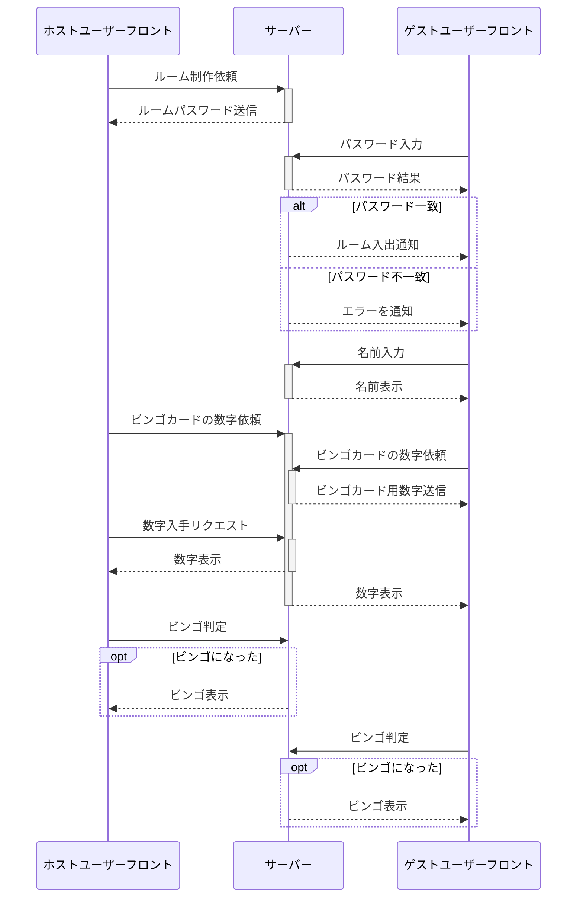

# Bingo
Goを使ったバックエンドの練習

```mermaid
sequenceDiagram;
participant ホストユーザーフロント
participant サーバー
participant ゲストユーザーフロント

ホストユーザーフロント  ->>+     サーバー:ルーム制作依頼
サーバー               -->>-     ホストユーザーフロント:ルームパスワード送信

ゲストユーザーフロント  ->>+     サーバー:パスワード入力
サーバー               -->>-     ゲストユーザーフロント:パスワード結果
alt パスワード一致　
サーバー　-->>  ゲストユーザーフロント:ルーム入出通知
else パスワード不一致
サーバー -->>   ゲストユーザーフロント:エラーを通知
end

ゲストユーザーフロント  ->>+     サーバー:名前入力
サーバー               -->>-      ゲストユーザーフロント:名前表示

ホストユーザーフロント  ->>+     サーバー:ビンゴカードの数字依頼
ゲストユーザーフロント  ->>+     サーバー:ビンゴカードの数字依頼
サーバー               -->>-     ゲストユーザーフロント:ビンゴカード用数字送信

ホストユーザーフロント  ->>+     サーバー:数字入手リクエスト
サーバー               -->>-     ホストユーザーフロント:数字表示
サーバー               -->>-     ゲストユーザーフロント:数字表示

ホストユーザーフロント  ->>     サーバー:ビンゴ判定
opt ビンゴになった
サーバー    -->>    ホストユーザーフロント:ビンゴ表示
end
ゲストユーザーフロント  ->>     サーバー:ビンゴ判定
opt ビンゴになった
サーバー    -->>    ゲストユーザーフロント:ビンゴ表示
end
```

ゲームエンジンのプログラムを読んでおく