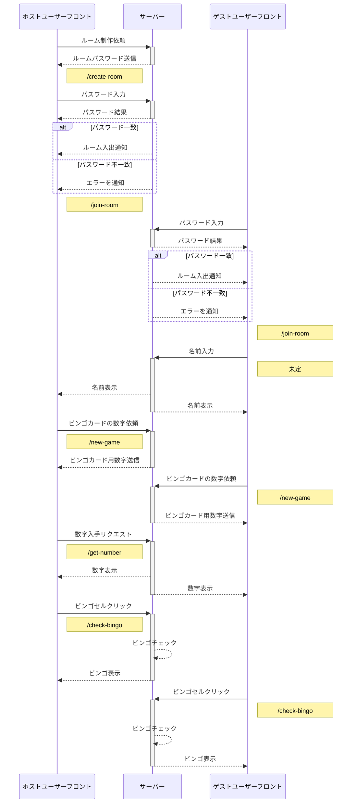

# Bingo
Goを使ったバックエンドの練習

```mermaid
sequenceDiagram;
participant ホストユーザーフロント
participant サーバー
participant ゲストユーザーフロント

ホストユーザーフロント  ->>+     サーバー:ルーム制作依頼
サーバー               -->>-     ホストユーザーフロント:ルームパスワード送信
Note right of ホストユーザーフロント:/create-room

ホストユーザーフロント  ->>+     サーバー:パスワード入力
サーバー               -->>-     ホストユーザーフロント:パスワード結果
alt パスワード一致　
サーバー　-->>  ホストユーザーフロント:ルーム入出通知
else パスワード不一致
サーバー -->>   ホストユーザーフロント:エラーを通知
end
Note right of ホストユーザーフロント:/join-room

ゲストユーザーフロント  ->>+     サーバー:パスワード入力
サーバー               -->>-     ゲストユーザーフロント:パスワード結果
alt パスワード一致　
サーバー　-->>  ゲストユーザーフロント:ルーム入出通知
else パスワード不一致
サーバー -->>   ゲストユーザーフロント:エラーを通知
end
Note right of ゲストユーザーフロント:/join-room

ゲストユーザーフロント  ->>+     サーバー:名前入力
Note right of ゲストユーザーフロント:未定
サーバー               -->>      ホストユーザーフロント:名前表示
サーバー               -->>-      ゲストユーザーフロント:名前表示

ホストユーザーフロント  ->>+     サーバー:ビンゴカードの数字依頼
Note right of ホストユーザーフロント:/new-game
サーバー               -->>-     ホストユーザーフロント:ビンゴカード用数字送信
ゲストユーザーフロント  ->>+     サーバー:ビンゴカードの数字依頼
Note right of ゲストユーザーフロント:/new-game
サーバー               -->>-     ゲストユーザーフロント:ビンゴカード用数字送信

ホストユーザーフロント  ->>+     サーバー:数字入手リクエスト
Note right of ホストユーザーフロント:/get-number
サーバー               -->>     ホストユーザーフロント:数字表示
サーバー               -->>-     ゲストユーザーフロント:数字表示

ホストユーザーフロント  ->>+     サーバー:ビンゴセルクリック
Note right of ホストユーザーフロント:/check-bingo
サーバー               -->>     サーバー:ビンゴチェック
サーバー               -->>-     ホストユーザーフロント:ビンゴ表示

ゲストユーザーフロント  ->>+     サーバー:ビンゴセルクリック
Note right of ゲストユーザーフロント:/check-bingo
サーバー               -->>     サーバー:ビンゴチェック
サーバー               -->>-     ゲストユーザーフロント:ビンゴ表示
```

ゲームエンジンのプログラムを読んでおく
ゲームエンジンのプログラムを読んでおく
ホストの画面とゲストの画面はべっこで分けた方がよいかも
　ホストの画面は数字だけ表示させればいいかも
ビンゴカードの表示リクエストしなければ数字だけ大きく表示されればいいと思う
お楽しみ会とかの数字表示すればいいね

入手リクエストして数字表示